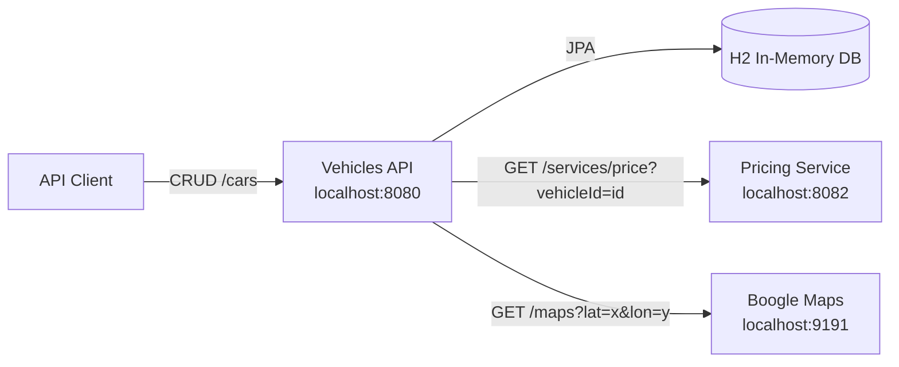

# Car Location & Pricing Microservices

A Spring Boot microservices project for managing vehicle inventory while enriching each vehicle with live pricing and mock geocoded address data. The system is split into three independently runnable services: a public Vehicles API, a Pricing Service, and a Boogle Maps mock service.

This repository began as the Udacity Java Nanodegree Vehicles API project, but the current codebase already includes the core TODO implementations: CRUD endpoints, HATEOAS responses, OpenAPI documentation, validation handling, MVC tests, and service-to-service calls.

---

## Table of Contents

- [What I Found](#what-i-found)
- [Architecture](#architecture)
- [Services](#services)
- [Tech Stack](#tech-stack)
- [Prerequisites](#prerequisites)
- [Quick Start](#quick-start)
- [API Reference](#api-reference)
- [Example Payloads](#example-payloads)
- [Testing](#testing)
- [Configuration](#configuration)
- [Project Structure](#project-structure)
- [Recommended Improvements](#recommended-improvements)
- [License](#license)

---

## What I Found

I inspected the repository service by service and found a compact, educational microservices system with clear responsibilities:

- **Vehicles API is the main entry point.** It owns vehicle persistence, exposes `/cars`, validates request bodies, returns HATEOAS links, and enriches individual vehicle reads with pricing and address information.
- **Pricing Service is a small supporting service.** It exposes `/services/price?vehicleId={id}` on port `8082` and returns deterministic in-memory prices for vehicle IDs `1` through `19`.
- **Boogle Maps is a mock maps provider.** It exposes `/maps?lat={lat}&lon={lon}` on port `9191` and returns a random address from an embedded address list.
- **The code is already functional and modernized in places.** The project uses Spring Boot 3.x, Java 21, Jakarta validation/persistence imports, springdoc OpenAPI, H2, WebClient, and JUnit 5.
- **The biggest opportunity is production hardening.** The services work well for a classroom/demo scenario, but they would benefit from Docker Compose, centralized configuration, service discovery, resilience patterns, stronger tests, observability, and persistent backing stores.

---

## Architecture



### Request Flow

1. A client creates or updates a car through the Vehicles API.
2. The Vehicles API stores vehicle data in an H2 database.
3. When a client retrieves a single car, the Vehicles API calls:
   - Pricing Service for the vehicle price.
   - Boogle Maps for address details based on latitude and longitude.
4. The Vehicles API returns the enriched vehicle representation with HATEOAS links.

---

## Services

| Service | Module | Default Port | Responsibility |
| --- | --- | ---: | --- |
| Vehicles API | `vehicles-api` | `8080` | Vehicle CRUD, validation, HATEOAS, OpenAPI docs, enrichment orchestration |
| Pricing Service | `pricing-service` | `8082` | Returns a price for a vehicle ID |
| Boogle Maps | `boogle-maps` | `9191` | Returns mock address data for coordinates |

---

## Tech Stack

- **Java 21**
- **Spring Boot 3.x**
- **Spring Web MVC**
- **Spring Data JPA**
- **Spring HATEOAS**
- **Spring WebFlux WebClient** for outbound HTTP calls
- **H2** in-memory database
- **springdoc-openapi** for Swagger/OpenAPI UI
- **ModelMapper** for address-to-location mapping
- **Maven** for builds and test execution
- **JUnit 5 / Spring MockMvc** for tests

---

## Prerequisites

- Java 21+
- Maven 3.9+
- Three terminal windows, or a process manager, to run all services at once

Check your Java version:

```bash
java -version
```

---

## Quick Start

Run the services in this order so the Vehicles API can reach its dependencies.

### 1. Start Boogle Maps

```bash
cd boogle-maps
mvn spring-boot:run
```

Health check/example call:

```bash
curl "http://localhost:9191/maps?lat=40.73061&lon=-73.935242"
```

### 2. Start Pricing Service

```bash
cd pricing-service
mvn spring-boot:run
```

Example call:

```bash
curl "http://localhost:8082/services/price?vehicleId=1"
```

### 3. Start Vehicles API

```bash
cd vehicles-api
mvn spring-boot:run
```

OpenAPI/Swagger UI:

```text
http://localhost:8080/swagger-ui.html
```

Depending on your springdoc version and redirect behavior, this may redirect to:

```text
http://localhost:8080/swagger-ui/index.html
```

---

## API Reference

### Vehicles API

Base URL:

```text
http://localhost:8080
```

| Method | Endpoint | Description |
| --- | --- | --- |
| `GET` | `/cars` | List all vehicles |
| `GET` | `/cars/{id}` | Get one vehicle enriched with price and address |
| `POST` | `/cars` | Create a vehicle |
| `PUT` | `/cars/{id}` | Update a vehicle |
| `DELETE` | `/cars/{id}` | Delete a vehicle |

### Pricing Service

Base URL:

```text
http://localhost:8082
```

| Method | Endpoint | Description |
| --- | --- | --- |
| `GET` | `/services/price?vehicleId={id}` | Get price for a vehicle ID |

> Note: The current in-memory pricing implementation supports IDs `1` through `19`.

### Boogle Maps

Base URL:

```text
http://localhost:9191
```

| Method | Endpoint | Description |
| --- | --- | --- |
| `GET` | `/maps?lat={lat}&lon={lon}` | Get a mock address for coordinates |

> Note: The current mock implementation accepts latitude and longitude but returns a random address.

---

## Example Payloads

### Create a Vehicle

```bash
curl -i -X POST "http://localhost:8080/cars" \
  -H "Content-Type: application/json" \
  -d '{
    "condition": "USED",
    "details": {
      "body": "sedan",
      "model": "Impala",
      "manufacturer": {
        "code": 101,
        "name": "Chevrolet"
      },
      "numberOfDoors": 4,
      "fuelType": "Gasoline",
      "engine": "3.6L V6",
      "mileage": 32280,
      "modelYear": 2018,
      "productionYear": 2018,
      "externalColor": "white"
    },
    "location": {
      "lat": 40.73061,
      "lon": -73.935242
    }
  }'
```

### Retrieve an Enriched Vehicle

```bash
curl "http://localhost:8080/cars/1"
```

The returned vehicle includes persisted car data plus transient fields such as `price` and address details under `location`.

### Update a Vehicle

```bash
curl -i -X PUT "http://localhost:8080/cars/1" \
  -H "Content-Type: application/json" \
  -d '{
    "condition": "NEW",
    "details": {
      "body": "coupe",
      "model": "Mustang",
      "manufacturer": {
        "code": 102,
        "name": "Ford"
      },
      "numberOfDoors": 2,
      "fuelType": "Gasoline",
      "engine": "5.0L V8",
      "mileage": 20,
      "modelYear": 2024,
      "productionYear": 2024,
      "externalColor": "blue"
    },
    "location": {
      "lat": 34.052235,
      "lon": -118.243683
    }
  }'
```

### Delete a Vehicle

```bash
curl -i -X DELETE "http://localhost:8080/cars/1"
```

---

## Testing

Run tests from each module:

```bash
cd boogle-maps
mvn test
```

```bash
cd pricing-service
mvn test
```

```bash
cd vehicles-api
mvn test
```

Or run them from the repository root:

```bash
(cd boogle-maps && mvn test)
(cd pricing-service && mvn test)
(cd vehicles-api && mvn test)
```

---

## Configuration

### Vehicles API

`vehicles-api/src/main/resources/application.properties`

| Property | Default | Purpose |
| --- | --- | --- |
| `pricing.endpoint` | `http://localhost:8082` | Pricing Service base URL |
| `maps.endpoint` | `http://localhost:9191` | Boogle Maps base URL |
| `spring.jpa.defer-datasource-initialization` | `true` | Defers data initialization until after JPA setup |
| `spring.h2.console.settings.web-allow-others` | `true` | Allows remote H2 console access |
| `spring.mvc.pathmatch.matching-strategy` | `ant_path_matcher` | Path matching strategy |

### Pricing Service

`pricing-service/src/main/resources/application.properties`

| Property | Default | Purpose |
| --- | --- | --- |
| `server.port` | `8082` | Pricing Service port |

### Boogle Maps

`boogle-maps/src/main/resources/application.properties`

| Property | Default | Purpose |
| --- | --- | --- |
| `server.port` | `9191` | Boogle Maps port |

---

## Project Structure

```text
.
├── boogle-maps/          # Mock location/address microservice
├── pricing-service/      # Vehicle pricing microservice
├── vehicles-api/         # Main public vehicle inventory API
├── util/                 # IDE/style helper files
├── LICENSE
└── README.md
```

Key source locations:

```text
vehicles-api/src/main/java/com/udacity/vehicles
├── api/                  # REST controllers, HATEOAS assembler, API errors
├── client/               # WebClient integrations with maps and pricing
├── config/               # OpenAPI configuration
├── domain/               # JPA entities/value objects/repositories
└── service/              # Vehicle business logic

pricing-service/src/main/java/com/udacity/pricing
├── api/                  # Pricing endpoint
├── domain/price/         # Price model/repository placeholder
└── service/              # In-memory pricing logic

boogle-maps/src/main/java/com/udacity/boogle/maps
└──                       # Mock maps controller, address model, address repository
```

---

## Recommended Improvements

### High Impact

1. **Add Docker Compose**
   - Start all three services with one command.
   - Make onboarding and demos much easier.

2. **Introduce service resilience**
   - Add request timeouts, retries, circuit breakers, and fallback policies with Resilience4j.
   - The code already has graceful fallbacks for pricing/maps failures, but production systems need stronger controls.

3. **Move configuration to environment variables**
   - Keep local defaults but allow `PRICING_ENDPOINT`, `MAPS_ENDPOINT`, and service ports to be overridden.

4. **Add persistent storage**
   - Replace demo-only in-memory behavior with PostgreSQL or another durable database.
   - Persist pricing data instead of generating it statically at startup.

5. **Expand automated tests**
   - Add controller tests for validation errors, update operations, not-found responses, and downstream service failures.
   - Add service-level tests with mocked clients.

### Medium Impact

6. **Normalize Spring Boot versions**
   - Vehicles API uses a newer Spring Boot patch version than the two support services. Align all modules to the same Spring Boot version for consistency.

7. **Create a parent Maven project**
   - A root aggregator `pom.xml` would allow `mvn test` once from the root instead of running each module separately.

8. **Improve observability**
   - Add Spring Boot Actuator, structured logs, correlation IDs, and metrics.

9. **Document OpenAPI for every service**
   - Vehicles API already has OpenAPI setup; Pricing and Maps would benefit from matching docs.

10. **Improve mock maps determinism**
    - Return an address based on coordinates or seed the random generator for predictable tests.

### Nice to Have

11. **Add CI/CD**
    - Use GitHub Actions to run tests, build jars, and optionally publish container images.

12. **Add security controls**
    - Disable open H2 console access outside local development.
    - Add authentication/authorization if this API becomes user-facing.

13. **Use DTOs for API boundaries**
    - Avoid exposing JPA entities directly in public request/response contracts.

14. **Add database migrations**
    - Use Flyway or Liquibase when moving to a persistent database.

---

## License

This project is distributed under the license included in [`LICENSE`](LICENSE).
